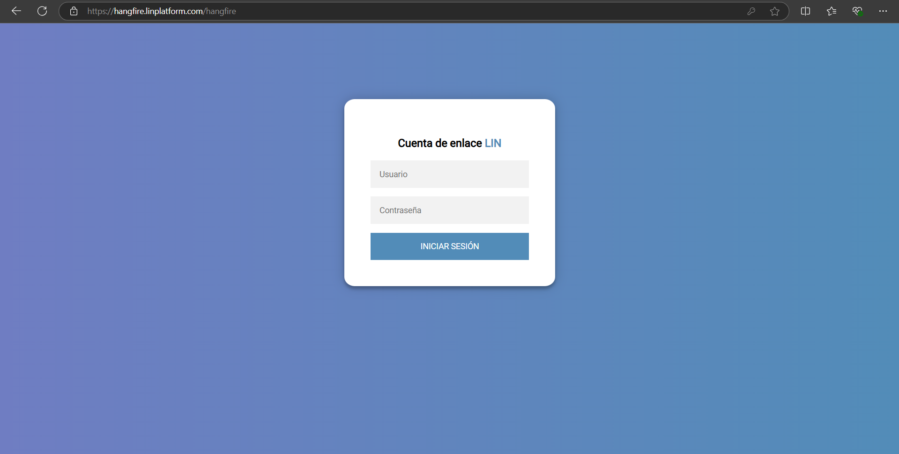
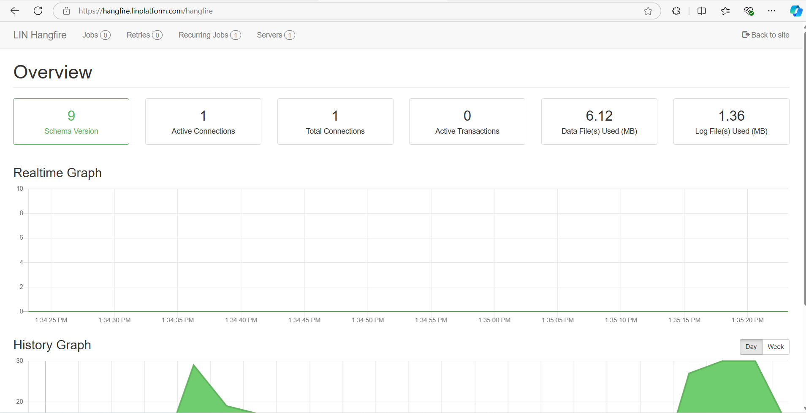

# LIN Hangfire

Servidor de hangfire de uso general en LIN Platform.

En este proyecto, el tablero de Hangfire está protegido para que solo los usuarios autenticados puedan acceder a él. Se ha integrado con LIN Cloud Identity (LIN Identity) para gestionar la autenticación y autorización de usuarios.

